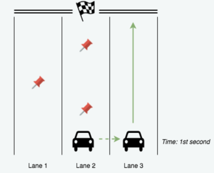

## Racing Car

Chris is playing the "Racing Car" arcade game. In this game, Chris is controlling a car which can move sideways but the car keeps moving forward at all times. Chris can move the car into any lane at any moment. There are some obstacles on the track and no two obstacles share the same position on the track. There are 3 lanes in the game and Chris starts the game from the middle lane. Determine the minimum sideways moment needed in order to complete the game. Note that a movement at one moment, be it from lane 1 to lane 2 or from lane 1 to lane 3, is counted as a single movement.

For example, for n = 3 obstacles, with the lane of obstacles as given by `obstacleLanes = [2, 1, 2]`, Chris can move the car in the first second to lane 3 and the total number of motions required will be 1.



### Tree

构造一个二叉树，node有子节点的条件为在当前lane遇到了障碍物，若没有障碍物则不会产生子节点．问题则转化为求从root到leaf的最短路径

```python
class TreeNode(object):
    def __init__(self, val=0, left=None, right=None):
        self.val = val
        self.left = left 
        self.right = right
        
class RaceCar():
    def minimumMovement(self, obstacleLanes):
        root = TreeNode(2)
        Nodes = [root]
        for i in obstacleLanes:
            childs = self.choice(i)
            for node in Nodes:
                if node.val == i:
                    node.left = TreeNode(childs[0])
                    node.right = TreeNode(childs[1])
                    Nodes.remove(node)
                    Nodes.append(node.left)
                    Nodes.append(node.right)
        
        return self.minDepth(root) - 1
        
    def choice(self, n):
        if n == 1:
            return [2, 3]
        elif n == 2:
            return [1, 3]
       	else:
            return [1, 2]
    
    def minDepth(self, root):
        if root is None:
            return 0
        
        left_height = self.minDepth(root.left)
        right_height = self.minDepth(root.right)
        
        return 1 + min(left_height, right_height)
```

